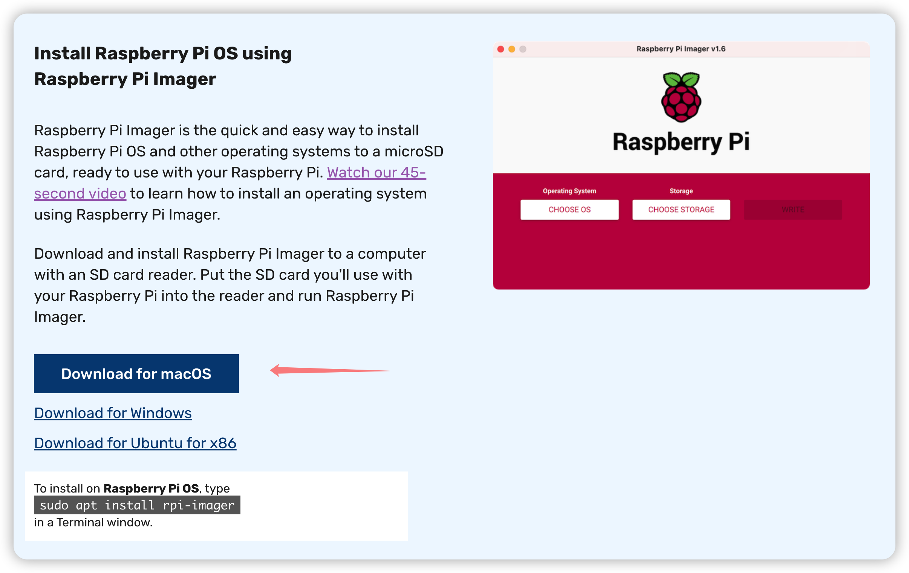
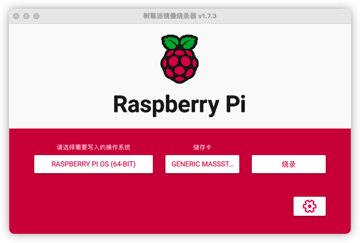
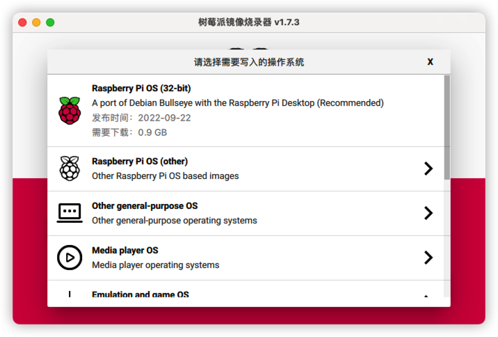

+++
date = '2023-02-11T12:54:53+08:00'
draft = false
title = '初见树莓派：系统安装'
series = '树莓派入门'
categories = ['raspberryPi']
+++

树莓派上手第一件事，系统安装。

## 1 准备SD卡

首先拿出一个sd卡，官方推荐8GB以上的大小，如果只需要安装Lite版本系统(后面会讲)，那么4GB也可以。

## 2 OS安装

步骤：

-   将sd卡连接到电脑上
-   下载Imager软件，选择合适的OS版本
-   选择想要安装OS的sd卡
-   检查选项，并点击"烧录"来写入数据到sd卡

具体步骤如下：

### 2.1 下载Imager软件，选择合适的OS版本

打开树莓派官网的软件下载页面：[Imager](https://www.raspberrypi.com/software/)

现在官方提供了系统镜像的安装软件(以前只有镜像文件)，系统安装更简单了，点击下载。完成后打开：

点击选择操作系统，可以看到提供了多个选项：

> 树莓派支持许多操作系统，如影音KODI/OSMC/LibreELEC/XBian；游戏PetroPi/Recalbox；智能家居HomeBridge/HomeAssistant等，但是如果没有特殊用途，一般还是选择官方的RaspberryPiOS作为操作系统。可以在[statistics page](https://rpi-imager-stats.raspberrypi.com/)看到哪个系统被最多地安装。

#### RaspberryPiOS提供了许多版本，如何选择？

可以直接选择推荐版本写入，就是最上面那个`Raspberry Pi OS(32-bit)`。也可以自己根据树莓派的型号和需求来选择：点击`Raspberry Pi OS(other)`选择。

不同版本的区别如下：

1.  Raspberry Pi OS Lite(32-bit/64-bit)：32位或64位的CLI版本，没有桌面，只有命令行，最为精简，是一个基础系统。所有树莓派都可以使用32系统，64位系统只能3B, 3B+, 4, 400, CM3, CM3+, CM4, Zero2W使用。如果可以使用64位系统，建议使用64位，因为性能会更好。

2.   Raspberry Pi OS(32-bit)：这是官方默认推荐的版本，32位带桌面

3.   Raspberry Pi OS Full(32-bit)：32位带桌面的版本，并且在此基础上加上了一些官方推荐的软件包，如python编辑器之类的，大小有2.6G，如果内存卡比较小的话不推荐安装。

4.   Raspberry Pi OS(Legacy)：带有桌面和一些安全升级的版本。

5.   Raspberry Pi OS Lite(Legacy)：不带桌面的安全升级版本。

### 2.2 检查选项，并点击"烧录"来写入数据到sd卡

选择好OS版本和sd卡后，有些OS版本可以添加高级设置Advanced Options，能够在boot前打开ssh，或者设置树莓派的hostname等等。点击右下角的齿轮进行配置。部分配置详情如下：

`开启SSH服务`：如果不打算外接键盘和显示器的话，推荐打开ssh，选择使用密码登陆。后期使用电脑ssh连接树莓派桌面使用。

`Set username and password`：登陆时的用户名和密码，就是电脑开机时的用户名和密码。

`配置WiFi`：树莓派自动连接的WiFi。如果使用电脑ssh连接树莓派需要在同一网络下，必须配置该选项。

## 3 开启树莓派

将数据写入完成的sd卡插回树莓派，连接电源，即可开启树莓派。

树莓派开启后红灯常量，黄灯不规律闪烁。如果红灯不亮代表未连接电源；如果红灯常量但黄灯有规律闪烁则是文件不全，考虑重新安装操作系统。

> 如果红灯常量且黄灯规律地两次闪烁，可能是电源电压不足，树莓派需要5V3A的电源，如果电源功率不足，树莓派不能正常运行，这是本人遇到过的问题

树莓派开启后可以用连接键盘/屏幕或者ssh远程的连接方式使用，键盘/屏幕方式不赘述，ssh远程连接的方式见下一篇文章。
