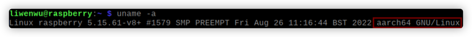
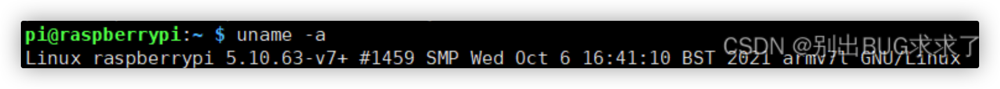
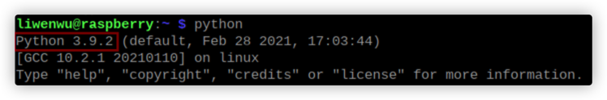
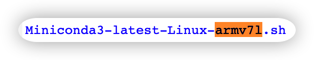
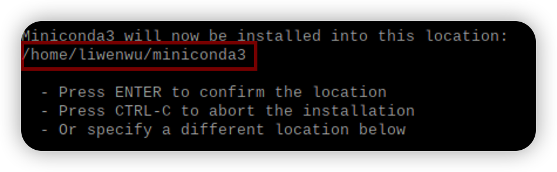
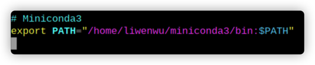
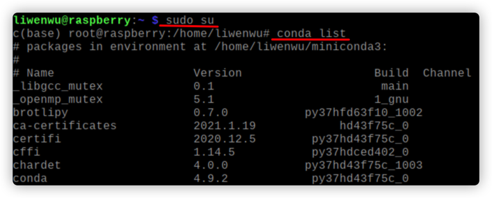
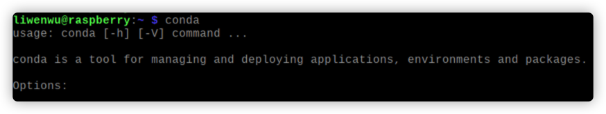

+++
date = '2023-02-13T01:37:53+08:00'
draft = false
title = '树莓派安装miniconda'
series = '树莓派入门'
categories = ['raspberryPi']
+++

树莓派4B已经将处理器从arm架构换成了aarch64架构，所以能够使用最新的aarch64版本的miniconda了。但是参考部分文章并实测发现，当前4B不能兼容miniconda3 4.10以上的版本，所以本文使用4.9版本。

4B以下版本请参考文章内容自行更改安装内容。

## <font color='sky blue'>前置步骤</font>

本部分主要引导读者查看本机的主要信息从而匹配最佳版本。

### 1   **查看本机处理器架构**

``` shell
uname -a
```



红框的那一串就是你手上树莓派的架构。如果是4B并且用的[Imager](https://www.raspberrypi.com/software/)安装的OS的话详见文章[初见树莓派：系统安装](https://woofle.space/blogs/%E5%88%9D%E8%A7%81%E6%A0%91%E8%8E%93%E6%B4%BE%E7%B3%BB%E7%BB%9F%E5%AE%89%E8%A3%85)，显示的内容跟本文的应该是差不多的。如果是老版本的树莓派，那么显示的内容可能如下：



说明你的架构是armv7l，他们两个使用的软件是完全不同的，不能混用。

### 2 **查看本机python版本**

``` shell
python
```



第一行就是你本机的python版本。

## <font color='sky blue'>主要步骤</font>

得到上面的信息后，就可以选择合适的miniconda版本下载了，假设现在terminal所在的位置是`/home/pi/`

### 1 **获取miniconda安装包**

``` shell
wget https://repo.anaconda.com/miniconda/Miniconda3-py37_4.9.2-Linux-aarch64.sh
```

​	输入该命令将会把上面链接的文件下载到terminal当前文件夹`/home/pi/`下。

​	这个文件名表示该版本适合<font color='orange'>*python3.7*</font>，架构<font color='orange'>*aarch64*</font>的树莓派（Linux）安装，miniconda3的版本是4.9.2	

​	请读者根据自己机器的配置在[这个网页](https://repo.anaconda.com/miniconda/)上寻找下载合适的版本，注意如果是aarch64架构那miniconda3的版本不要超过4.10。

> 如果你的架构是armv7l，那么应该下载的文件是：
> 


### 2 **安装**

``` shell
sudo bash Miniconda3-py37_4.9.2-Linux-aarch64.sh
```

​	文件名是刚才找到的一样的文件名。

​	如果输入`sudo bash Miniconda3-py37_4.9.2-Linux-aarch64.sh`的话，即加了一个sudo命令，miniconda会自动安装给root用户，以后使用conda必须都要加`sudo`，很麻烦，而且会出现很多问题，这里建议<font color='red'>不使用sudo</font>，那么miniconda将会自动安装给当前用户，比如pi用户。

​	下文都是基于安装给<font color='red'>当前用户</font>实现的，<font color='purple'>如果有读者使用了sudo，请直接跳到本文后面的《适用于使用sudo命令安装miniconda的读者》部分。</font>但之后的使用亲测依然会出很多问题，比如不用sudo就不能pip，pip安装的包不能在当前用户环境下使用等等，所以普通用户的话非常不建议用sudo安装给超级用户，除非有特殊需求。

### 3  **等待安装**

​	安装过程中可能需要输入一些字符。请根据提示进行。



​	值得一提的是到这一步时会提示你安装Miniconda3的位置，会默认安装到当前用户目录下，按ENTER将执行默认设置。（如果上一步用了sudo，那么默认位置是`/root/miniconda3`）


 ### 4 添加环境变量

要在当前用户下使用conda，那么还必须把他的执行路径添加进环境变量。

```shell
vim ~/.bashrc
```

进入`.bashrc`文件，如果提示没有vim的话用`nano ~/.bashrc`也可以。

在文件的最后添加一行：

```vim
export PATH="/home/pi/miniconda3/bin:$PATH"
```



这里的pi是用户名字，比如我的用户名是liwenwu，所以是图中所示路径。写完后输入`:wq`退出vim。

> nano是先ctrl+o保存，再ctrl+x退出

``` shell
source ~/.bashrc
```

应用更改。

### 5 使用

```shell
conda list
```
即可看到输出conda已安装的包。

#### 至此conda已经完成安装，并且当前用户可以正常使用所有conda命令。

## <font color="red">错误分析</font>

<h3 style="color:skyblue;text-align:center">1</h3>

成功安装miniconda3之后，如果想要使用创建好的虚拟环境，即：

```shell
conda activate test
```

可能会报如下错误：

```shell
CommandNotFoundError: Your shell has not been properly configured to use 'conda activate'.
To initialize your shell, run
 
    $ conda init <SHELL_NAME>
 
Currently supported shells are:
  - bash
  - fish
  - tcsh
  - xonsh
  - zsh
  - powershell
 
See 'conda init --help' for more information and options.
 
IMPORTANT: You may need to close and restart your shell after running 'conda init
```

此时只需要根据提示初始化conda就可以，树莓派应该输入:

```shell
conda init bash
```

然后<font color='red'>重启terminal</font>，注意一定要重启一下，即可成功activate虚拟环境。


### 2


如果使用conda虚拟环境是出现pip相关问题，请参考文章：[树莓派miniconda3 pip 报错 illegal instruction](https://www.woofle.space/blogs/%E6%A0%91%E8%8E%93%E6%B4%BEminiconda3-pip-%E6%8A%A5%E9%94%99-illegal-instruction%E8%BF%90%E8%A1%8C%E7%A8%8B%E5%BA%8F%E6%98%BE%E7%A4%BAno-module-named-xxx/)，可完美解决。

### <font color='blue'>下面部分适用于使用sudo命令安装miniconda的读者，注意，以下部分只是为了解决部分读者可能出现的问题，也是本人遇到的一些问题，并不是推荐大家使用。</font>

### 使用sudo完成上述第2步后，接下部分：

### 3 超级用户使用

```shell
sudo su
conda list
exit
```

由于刚刚Miniconda自动启动了conda init，并且我们是在超级用户的权限下安装的Miniconda，所以他自动加入了root用户的环境变量，直接输入命令就可以看到提示。



### 4 更改权限

但是如果每次使用conda都要使用超级用户权限太过麻烦，所以我把他的权限更改给了用户（我默认使用的那一个）。

-   首先进入你安装miniconda3的目录，比如默认的是在/root，注意是miniconda3的上级目录

```shell
sudo su
cd /root
```

-   更改miniconda3文件的所有者

``` shell
# sudo su
chown -R pi miniconda3
exit
```

这里的`pi`就是你用户的名字，不输出任何东西就是更改成功了。

### 5 添加环境变量

要在当前用户下使用conda，那么还必须把他的执行路径添加进环境变量。

``` shell
vim ~/.bashrc
```

进入`.bashrc`文件，如果提示没有vim的话用`nano ~/.bashrc`也可以。

在文件的最后添加一行：

```vim
export PATH="/home/pi/miniconda3/bin:$PATH"
```


这里的pi也是用户名字。写完后输入`:wq`退出vim。

> nano是先ctrl+o保存，再ctrl+x退出

``` shell
source ~/.bashrc
```

应用更改。

### 6 尝试使用

``` shell
conda
```

显示如下信息表示成功：



## <font color="red">错误分析</font>

成功安装miniconda3之后，如果想要使用创建好的虚拟环境，即：

```shell
conda activate test
```
可能会报如下错误：

```shell
CommandNotFoundError: Your shell has not been properly configured to use 'conda activate'.
To initialize your shell, run
 
    $ conda init <SHELL_NAME>
 
Currently supported shells are:
  - bash
  - fish
  - tcsh
  - xonsh
  - zsh
  - powershell
 
See 'conda init --help' for more information and options.
 
IMPORTANT: You may need to close and restart your shell after running 'conda init
```

此时只需要根据提示初始化conda就可以，树莓派应该输入:
```shell
conda init bash
```
然后<font color='red'>重启terminal</font>，注意一定要重启一下，即可成功activate虚拟环境。

#### 更多关于sudo安装的错误分析请见文章[树莓派miniconda3 pip 报错 illegal instruction，运行程序显示No module named `xxx`](https://www.woofle.space/blogs/%E6%A0%91%E8%8E%93%E6%B4%BEminiconda3-pip-%E6%8A%A5%E9%94%99-illegal-instruction%E8%BF%90%E8%A1%8C%E7%A8%8B%E5%BA%8F%E6%98%BE%E7%A4%BAno-module-named-xxx/)。

## 参考文章

1.   [树莓派4B64位系统安装miniconda（折腾了几天终于解决）](https://blog.csdn.net/IT_lesliewu/article/details/124893143?utm_medium=distribute.pc_relevant.none-task-blog-2~default~baidujs_baidulandingword~default-0-124893143-blog-128620393.pc_relevant_3mothn_strategy_and_data_recovery&spm=1001.2101.3001.4242.1&utm_relevant_index=3)

2.   [树莓派上如何安装anaconda/miniconda环境配置](https://blog.csdn.net/weixin_39589455/article/details/128620393)